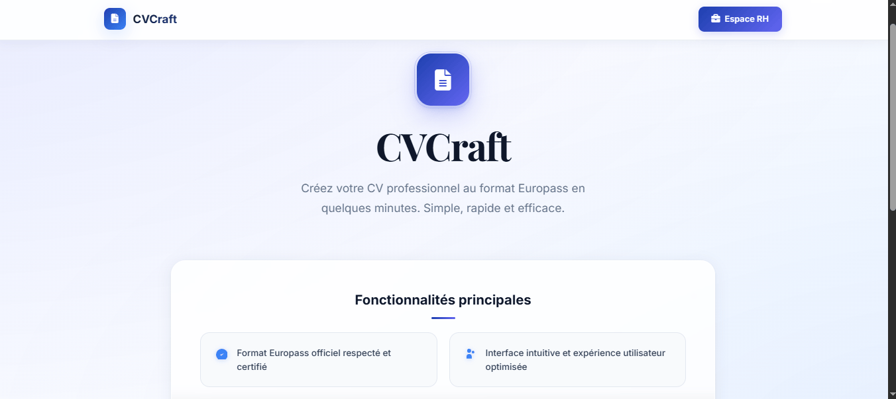

# CVCraft - Générateur de CV, recherche avancée et portail RH

CVCraft est une application web PHP/MySQL orientée CV, conçue pour générer, enregistrer, publier, modifier et rechercher des CV dans un environnement MVC. Le projet intègre aussi un moteur de recherche avancé, un espace RH pour la sélection des candidats, un module de parsing OCR et un système de ranking Python pour évaluer les CV selon des critères métiers.

---

## Vue d'ensemble

Le projet couvre plusieurs usages :

- création et édition de CV par les utilisateurs
- stockage sécurisé des données dans MySQL
- publication de CV pour les rendre visibles dans le moteur de recherche
- recherche multi-mots-clés avec filtres et pondération
- portail RH pour rechercher des profils candidats
- import de CV depuis PDF/image via OCR
- génération de CV selon plusieurs sections (profil, formation, expérience, projets, compétences, langues, certifications)
- architecture MVC compatible avec XAMPP / PHP 8 et un environnement de développement local simple

---

## Fonctionnalités principales

- Gestion d'utilisateurs avec inscription, connexion et sessions
- Création de CV structurée en plusieurs étapes
- Sauvegarde des CV et rechargement pour modification
- Publication / dépublication de CV
- Suppression individuelle ou globale des CV
- Recherche avancée de CV (mots-clés, filtres, pondération, expressions entre guillemets)
- Portail RH avancé avec filtres de filière, compétences, profil professionnel et pondération
- Parcours d’import OCR pour extraire les informations depuis des documents PDF ou image
- Système de ranking Python pour classer les CV selon un besoin métier
- Compatibilité avec le format Europass et modèles généraux de CV

---

## Stack technique

- PHP 8.x
- MySQL / MariaDB
- HTML / CSS / JavaScript
- Architecture MVC légère dans `core/` et `app/`
- Python 3.x pour le parsing OCR et le ranking
- Tesseract OCR (optionnel, selon l’usage du module OCR)

---

## Structure du dépôt

- `app/` — logique applicative MVC
  - `app/Controllers/` — contrôleurs principaux (`AuthController.php`, `CVController.php`, `SearchController.php`, `FiliereController.php`)
  - `app/Models/` — modèles métier (`User.php`, `CV.php`, `CVSectionsManager.php`, etc.)
- `core/` — classes du framework léger
  - `bootstrap.php`, `Database.php`, `Model.php`, `Controller.php`, `Router.php`
- `config/` — configuration centrale de l’application (`app.php`)
- `Login_Signup/` — authentification utilisateur et RH, scripts de traitement des formulaires
- `Cv_generator/` — interface principale pour la création et l’édition des CV
- `cv_search_system/` — moteur de recherche multi-mots-clés / interface Web / gestion d’historique
- `cv_ranking/` — scripts Python pour le ranking et l’API de scoring des CV
- `parsing/` — scripts OCR / extraction de contenu depuis fichiers PDF et images
- `rh/` — espace RH / portail de recherche de candidats
- `scripts/` — utilitaires (ex. `seed_cvs.py`)
- `tests/` — tests Python du parseur
- `index.php` — point d’entrée principal
- `main_page.html` — landing page publique
- `cv_craft.sql` — schéma SQL principal
- `requirements.txt` — dépendances Python pour le parsing OCR

---

## Base de données

Le projet s’appuie sur la base `cv_craft` (voir `cv_craft.sql`).

Tableaux principaux :

- `utilisateurs`
- `cvs`
- `profils`
- `formations`
- `experiences`
- `projets`
- `certificats`
- `competences`
- `langues`
- `informations_personnelles`
- `filieres`

Le fichier `config/app.php` centralise les paramètres de connexion et la configuration de session.

---

## Prérequis

1. XAMPP / WAMP / LAMP avec Apache et MySQL
2. PHP 8.x
3. MySQL ou MariaDB
4. Python 3.8+ pour les modules OCR / ranking
5. Tesseract OCR installé sur le système si vous utilisez le parsing de PDF/image
6. Accès au dossier `htdocs` pour le projet local

---

## Installation rapide

1. Copier le projet dans le dossier web local, par exemple :

   `D:\xampp\htdocs\CV_Generator`

2. Démarrer Apache et MySQL dans XAMPP.

3. Importer le schéma SQL :

   - ouvrir phpMyAdmin
   - créer la base `cv_craft`
   - importer `cv_craft.sql`

4. Vérifier la configuration de connexion dans `config/app.php` :

   - `host`
   - `dbname`
   - `username`
   - `password`

5. Installer les dépendances Python de parsing (si vous utilisez OCR) :

   `pip install -r requirements.txt`

6. Installer Tesseract OCR et s’assurer que `tesseract` est accessible dans le PATH.

7. Ouvrir le projet dans le navigateur :

   `http://localhost/CV_Generator/`

8. L’application redirige vers la page d’accueil, puis vers l’authentification / la création de CV.

---

## Configuration importante

- `config/app.php` contient les paramètres de l’application, la base de données et la timezone.
- `core/Database.php` centralise la connexion PDO à MySQL.
- `core/bootstrap.php` charge les classes automatiquement.
- Les sessions sont configurées avec un nom dédié (`CV_CRAFT_SESSION`) et une durée de vie ajustable.

---

## Points d’entrée utiles

- Accueil public : `/main_page.html`
- Authentification : `/Login_Signup/auth.html`
- Espace utilisateur : `/Cv_generator/user_home.html`
- Générateur de CV : `/Cv_generator/home.html`
- Recherche de CV : `/cv_search_system/cv_search_interface.html`
- Portail RH : `/rh/index.html`
- Index PHP : `/index.php`

Handlers / contrôleurs applicatifs :

- `/Login_Signup/login_handler_mvc.php`
- `/Login_Signup/signup_handler_mvc.php`
- `/Cv_generator/generate_cv_mvc.php`
- `/Cv_generator/get_cv_data_mvc.php`
- `/Cv_generator/get_user_cvs_mvc.php`
- `/cv_search_system/search_handler_mvc.php`

---

## Moteur de recherche avancée

Le système de recherche de CV supporte :

- plusieurs mots-clés
- expressions entre guillemets
- filtres de domaine / données métier
- gestion de pondération par section
- calcul de pertinence et statistiques de résultat
- recherche publique sur les CV publiés

Les fichiers clés sont :

- `cv_search_system/cv_search_system.php`
- `cv_search_system/cv_search_interface.html`
- `cv_search_system/search_handler_mvc.php`
- `cv_search_system/weight_manager.php`
- `cv_search_system/search_history_manager.php`

---

## Portail RH

Le dossier `rh/` propose une interface de recherche de candidats orientée recrutement. Elle permet :

- recherche par profil professionnel
- recherche par compétences techniques et intitulés de poste
- filtres avancés par filière
- pondération des champs métier
- visualisation et gestion des candidats pertinents

L’interface RH est accessible via `rh/index.html` ou depuis la page d’accueil via le bouton “Espace RH”.

---

## Parsing OCR et extraction de CV

Le dossier `parsing/` contient des scripts Python permettant d’extraire les informations de documents PDF ou image puis de structurer le contenu dans des sections de CV.

Dépendances :

`pip install -r requirements.txt`

L’outil OCR dépend de Tesseract, qui doit être installé et présent dans le PATH.

Fichiers principaux :

- `parsing/parse_cv.py`
- `parsing/install_ocr.py`
- `parsing/modele_cv.xml`

---

## Ranking des CV (Python)

Le dossier `cv_ranking/` contient un moteur Python de classement de CV basé sur le texte et les compétences. Il expose une API Flask pour calculer le score d’un ou plusieurs CV selon un besoin ciblé.

Installation Python additionnelle pour l’API RH / ranking :

`pip install -r rh/requirements.txt`

Points d’entrée principaux :

- `cv_ranking/cv_ranking.py`
- `cv_ranking/cv_api.py`

---

## Tests

Le dépôt contient des tests Python pour le module de parsing :

- `tests/test_parse_cv.py`
- `tests/test_parsing.py`

Exécution :

`pytest tests/`

---

## Développement et contribution

Pour étendre le projet :

- ajouter les modèles dans `app/Models/`
- ajouter les contrôleurs dans `app/Controllers/`
- maintenir la configuration centralisée dans `config/app.php`
- réutiliser la connexion unique fournie par `core/Database.php`
- rester compatible avec la structure SQL existante de `cv_craft.sql`

---

## Dépannage rapide

- Problème de connexion MySQL : vérifier `config/app.php` et les identifiants de la base `cv_craft`
- Page blanche / erreur PHP : vérifier que les fichiers sont bien servis par Apache et que XAMPP est démarré
- OCR non fonctionnel : vérifier l’installation de Tesseract et la présence des dépendances Python
- Résultats de recherche nuls : vérifier que les CV sont publiés et que les données sont bien présentes dans la base

---

## Fichiers clés à consulter

- `config/app.php`
- `core/Database.php`
- `app/Controllers/AuthController.php`
- `app/Controllers/CVController.php`
- `app/Models/User.php`
- `Cv_generator/home.html`
- `cv_search_system/cv_search_interface.html`
- `rh/index.html`

## License

This project is licensed under the MIT License. See the [LICENSE](LICENSE) file for details.
